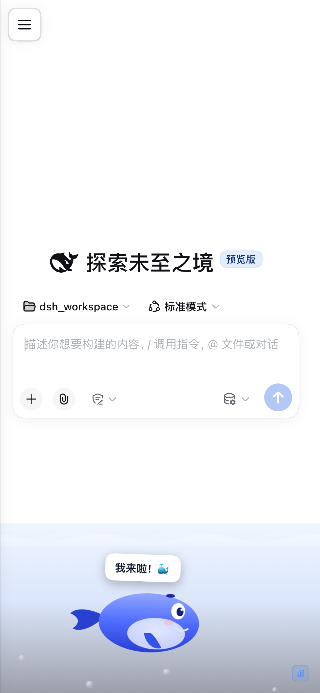
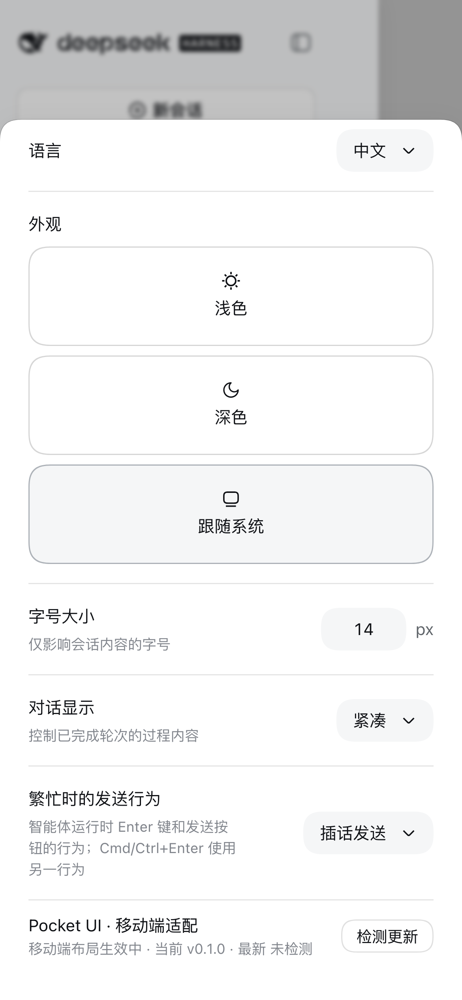
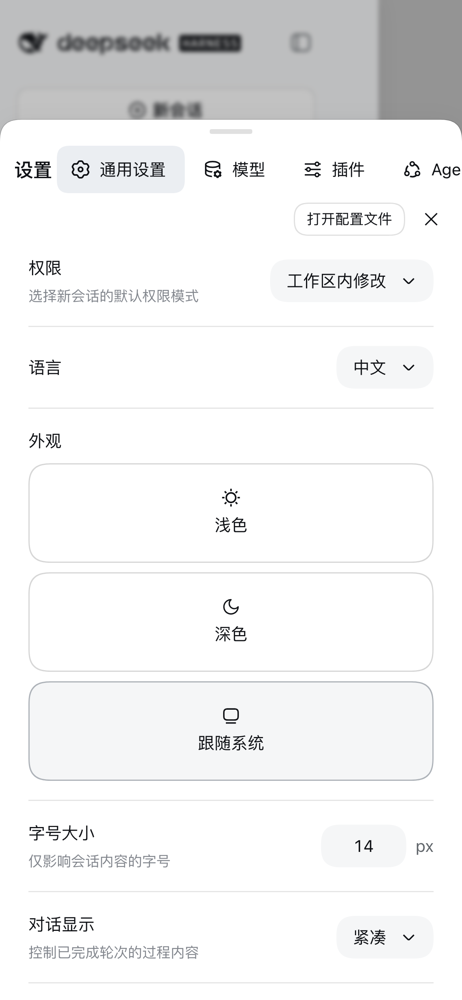

# dsh-pocket-ui

> DSH Web UI 的移动端适配插件 · 轻量核心版
>
> 窄屏好用，宽屏不打扰：手机竖屏下侧栏变抽屉、对话框变底部 sheet、刘海安全区避让、输入区不再打架；**鼠标操作的桌面端任何宽度都是完全 no-op**。

<p align="center">
  
  
  
</p>

---

## 它解决什么问题

DSH Web UI 是桌面优先的 React SPA。它的**外壳 CSS 里一条宽度断点都没有**（整个 `dsh-web-frontend` 只有 3 条 `prefers-reduced-motion`），没有 `viewport-fit=cover`，没有一处 `env(safe-area-inset-*)`。唯一的响应式能力是 JS 里的一个常量：

```js
const SIDEBAR_AUTO_COLLAPSE = 1024   // 低于此宽度把侧栏折成 56px 图标条
```

在 390px 的手机上，这远远不够：设置面板是 800px 宽的居中弹窗、会话区被 56px 图标条挤掉、刘海遮住顶部、输入区的模型选择器把发送键顶出屏幕。

本插件补齐这些。**它不重写 UI，只驯化宿主已有的 DOM**——往宿主插槽里塞自己的组件、注入一份改写布局的样式表、用一个协调层给宿主节点打标记。所以宿主的每一次功能更新你都能照常拿到。

## 功能

| 功能 | 说明 |
| --- | --- |
| **侧栏变抽屉** | 窄屏下侧栏收进覆盖式抽屉（宽 `min(84vw, 320px)`），会话区全宽；点会话行自动收起；有遮罩、Esc 可关 |
| **弹窗变底部 sheet** | 设置等 `aria-modal` 对话框改为贴底全宽 sheet，左侧竖排导航变成顶部横向滚动标签条 |
| **右栏全屏化** | 文件树 / 预览面板在窄屏下铺满，而不是挤在 300px 里 |
| **安全区避让** | 补上 `viewport-fit=cover`，把 `env(safe-area-inset-*)` 应用到抽屉、输入区、sheet；宿主改写 viewport meta 后会自动重申 |
| **输入区适配** | 覆写宿主的 composer 令牌收窄边距、限制模型选择器宽度、输入框字号提到 16px（避免 iOS 聚焦强制放大且无法缩回） |
| **会话头紧凑化** | 头部高度 97px → 56px，标签条改为横向滚动而不是逐字竖排 |
| **桌面端完全 no-op** | 见下节 |
| **设置入口** | 设置 → 通用 里有一行显示状态与版本，并提供「检测更新 / 升级」 |
| **在线更新** | 内置 registry 检查与一键升级（Host 半区），离线静默降级 |
| **互斥保护** | 检测到 `dsh-web-mobile` 存在时自动让位并在控制台说明，避免两套移动端布局互相打架 |

## 桌面端为什么是完全 no-op

三层保证，缺一不可：

1. **JS 门控**：`(max-width: 1023px) and (pointer: coarse)`。`pointer: coarse` 不是可选项——只按宽度判断会让**桌面分屏窗口、未最大化窗口、系统显示缩放 125–200%** 都误启移动端 UI（1920 物理像素 @200% 缩放 = 960 CSS 像素）。断点 1023px 刻意压在宿主自己的 1024px 之下，两者永不打架。
2. **样式表全部作用域化**：每一条规则都挂在 `html[data-pocket="on"]` 之下。门控关闭时**零条规则匹配**，没有需要撤销的东西。这条不变量由冒烟测试结构化断言（见下）。
3. **组件自弃**：插槽条目在桌面宽度下依然会被宿主渲染，所以 `PocketChrome` 在未激活时 `return null`，且协调层不会给宿主打任何标记。

## 安装

```sh
dsh plugin --profile web add dsh-pocket-ui
```

装完**重启 `dsh web`** 生效。

本地开发：

```sh
dsh plugin --profile web add link:/path/to/dsh-pocket-ui
```

> 从 `dsh-web-mobile` 迁移：两者会抢同一批 DOM，请先移除旧插件
> （`dsh plugin --profile web remove dsh-web-mobile`）。本插件内置互斥检测，即使两个都装也只会有一个生效并在控制台提示。

## 开发循环：什么需要重启，什么不需要

这是最容易搞混的一点。DSH 的 web profile 里有两个 HMR 插件，但它们**默认只有一个是开的**：

```yaml
- id: hmr                       # @deepseek-ai/cordis-plugin-hmr
  disabled: true                # ← 插件树 / 配置的热加载：默认关闭
- id: client-hmr                # @deepseek-ai/dsh-client-hmr
  # 没有 disabled → 默认开启
```

`dsh-client-hmr` 每 **500ms** `stat` 轮询每个插件 bundle 的 `(mtimeMs, size)`，一变就重新哈希，
并经 `/plugins/events` SSE 推给浏览器。

| 你改了什么 | 怎么生效 | 为什么 |
| --- | --- | --- |
| 已装插件的 `lib/client.js` | **自动热替换**（连刷新都不用） | client-hmr 轮询到文件变化 → 新 rev → SSE 推送 |
| 已装插件的 `lib/index.js`（Host 半区） | **必须重启** | 模块已被 import 进 Node 进程，没有卸载路径 |
| **新装 / 卸载插件** | **必须重启** | 插件树在启动时合成；`cordis-plugin-hmr` 是 `disabled: true` |
| 改 profile 的 `cordis.patch.yml` | **必须重启** | 同上 |

所以本插件**没有构建步骤**是刻意的：`lib/client.js` 本身就是源码，改完存盘，浏览器里的
页面会自己更新。这比「改 TS → 构建 → 刷新」快得多，也没有「忘记重新构建」的坑。

> 实测（headless Chrome + CDP）：页面加载后完全不碰浏览器，只改磁盘上的 `lib/client.js`，
> 数百毫秒后活着的页面里注入的样式表内容就已经变了。
>
> 注意 `hmr` 那行是 **base 层就带 `disabled: true`** 的，不是被后续层覆盖——所以
> 「装完新插件刷新一下就能用」对**全新安装**并不成立，那一步一定需要重启。

## 开关与卸载

标准做法是 patch 层禁用（不需要卸载）：

```yaml
# ~/.dsh/profiles/web/cordis.patch.yml
- id: pocket-ui
  disabled: true     # 注释掉或删除即恢复
```

彻底卸载：

```sh
dsh plugin --profile web remove dsh-pocket-ui
```

调试用 URL 参数（桌面浏览器上预览移动端布局）：

| 参数 | 效果 |
| --- | --- |
| `?pocket=mobile` | 强制启用移动端布局（忽略指针类型） |
| `?pocket=off` | 强制关闭 |

## 宿主升级后如何对账

本插件的宿主形状知识**全部集中在 `lib/client.js` 的 `findFrame()` / `parentOfSlot()` 与样式表的选择器里**，宿主升级只需检查这几处：

- [ ] `[data-shell-overlay]` 仍存在，且仍是 AppFrame 的直接子元素
- [ ] AppFrame 仍用**内联** `grid-template-columns`（我们的覆盖依赖 `!important`）
- [ ] `[data-slot="sidebar"|"main"|"rightbar"]` 仍存在（槽位出口是 `display:contents`，我们选它的**父元素**）
- [ ] 设置对话框仍是 `[role="presentation"] > [role="dialog"][aria-modal="true"]`
- [ ] `SIDEBAR_AUTO_COLLAPSE` 仍是 1024（决定我们的断点）
- [ ] `--dsh-composer-side-clearance` 等令牌仍存在

**不使用任何宿主 class 名**——它们是内容哈希（`pI_x6G_frame`、`wSkVaW_header`），每次宿主构建都会变，选择器会静默失配。这条由冒烟测试断言。

## 验证

```sh
node scripts/smoke-client.js     # 18 项：bundle 契约 + 样式表不变量
node scripts/smoke-host.js       # 14 项：路由 + 在线升级全链路（离线可跑）
node scripts/verify-cdp.mjs --url '<dsh web 打印的带 token URL>' --screenshot ./shots
```

CDP 探针（43 项断言）是唯一能验证真实 DOM、计算后几何与层叠的方式：

- **移动端**（390×844 + 触摸模拟）：门控开启、样式注入、地标打标、viewport meta、网格塌缩、抽屉开合、遮罩可点、sheet 贴底全宽且**不被困在抽屉里**、**内容真的能滚动**、无幽灵滚动、状态行渲染
- **窄桌面**（900×800，鼠标）+ **桌面**（1280×800）：门控关闭、零地标残留、零注入控件、宿主网格未被改动、侧栏未被改成抽屉

> headless Chrome **没有任何指针设备**，三个 `(pointer: …)` 查询全为 false。必须用
> `Emulation.setTouchEmulationEnabled` 才能让 `(pointer: coarse)` 命中——
> `Emulation.setEmulatedMedia` 对指针特征**静默无效**。

## 更新记录

### v0.1.1

修复两个线上缺陷：

- **插件关掉再启用会报 `webserver: duplicate prefix route "/pocket"`**。`webServer.register()` 是服务方法，返回的 disposer 框架不会自动跟踪，之前被丢弃了，路由因此活过卸载。已改为 `ctx.effect(() => …)` 包裹。同批把更新检查的定时器也从 `ctx.setInterval` 换成 `ctx.effect` 里的裸 `setInterval`（前者绑定在定时器服务的 fiber 上，会活过插件卸载）。
- **设置弹框无法上下滚动**，下半截设置项看不到。把面板从 `row` 翻成 `column` 后，内容列缺了 `min-height: 0`，无法收缩、撑破面板被裁掉，内层滚动容器拿不到受限高度。同时把 `max-height` 升级为 `88vh` + `88dvh` 双写。

### v0.1.0

首个版本。

## 已知边界（轻量核心版刻意不做）

- **无滑动手势**：抽屉靠按钮与遮罩开合。手势需要处理让位规则、原生滚动冲突、Chrome 边缘返回手势、选词劫持，投入产出比低。
- **不做第三方插件兼容**：只适配宿主自身 UI。第三方插件（dshmarket、dsh-file-viewer 等）的移动端表现不在范围内。
- **不压缩响应**：那是 Host 半区的流量优化，与 UI 适配无关。
- `:has()` 需要 Chromium 105+；更老的 WebView 上设置 sheet 的定位规则会静默失效（抽屉不受影响）。

## 许可

MIT
