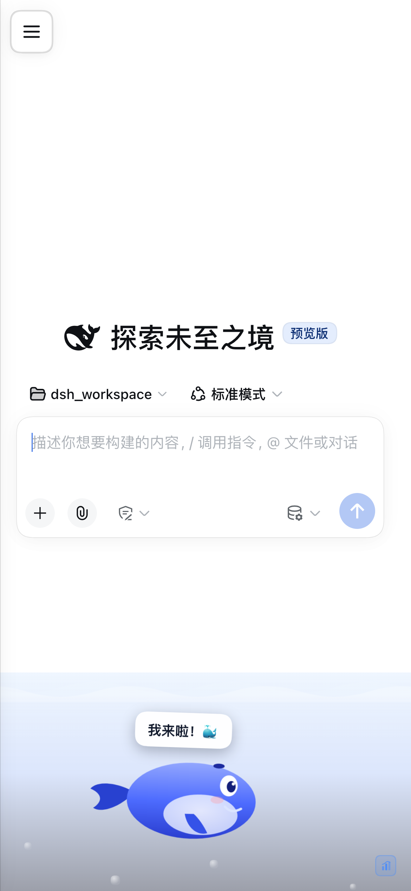
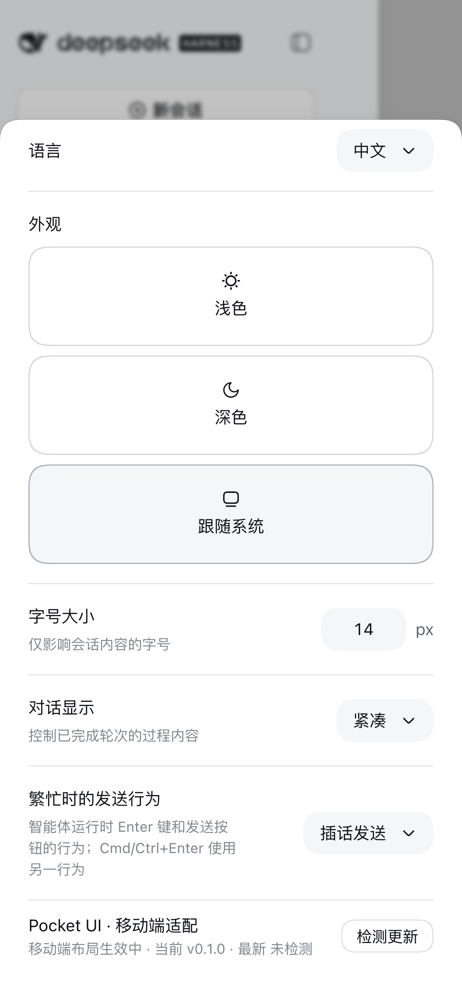
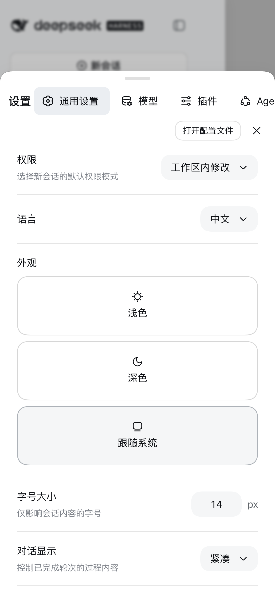

# dsh-pocket-ui

> DSH Web UI 的移动端适配插件 · 轻量核心版
>
> 窄屏好用，宽屏不打扰：手机竖屏下侧栏变抽屉、对话框变底部 sheet、刘海安全区避让、输入区不再打架；**鼠标操作的桌面端任何宽度都是完全 no-op**。

<p align="center">
  
  
  
</p>

---

## 它解决什么问题

DSH Web UI 是桌面优先的 React SPA。它的**外壳 CSS 里一条宽度断点都没有**（整个 `dsh-web-frontend` 只有 3 条 `prefers-reduced-motion`），没有 `viewport-fit=cover`，没有一处 `env(safe-area-inset-*)`。唯一的响应式能力是 JS 里的一个常量：

```js
const SIDEBAR_AUTO_COLLAPSE = 1024   // 低于此宽度把侧栏折成 56px 图标条
```

在 390px 的手机上，这远远不够：设置面板是 800px 宽的居中弹窗、会话区被 56px 图标条挤掉、刘海遮住顶部、输入区的模型选择器把发送键顶出屏幕。

本插件补齐这些。**它不重写 UI，只驯化宿主已有的 DOM**——往宿主插槽里塞自己的组件、注入一份改写布局的样式表、用一个协调层给宿主节点打标记。所以宿主的每一次功能更新你都能照常拿到。

## 功能

| 功能 | 说明 |
| --- | --- |
| **侧栏变抽屉** | 窄屏下侧栏收进覆盖式抽屉（宽 `min(84vw, 320px)`），会话区全宽；**面板内点击一律不拦截**（点会话行就是选会话），收起用宿主自带的「收起侧边栏」按钮；点面板外的遮罩也可关，Esc 同样有效 |
| **抽屉开关按钮** | 左下角 28px 细描边按钮，描边与三条杠共用 `#4176e6`；只在抽屉关闭时出现（打开时由遮罩接管）。避让安全区 |
| **弹窗变底部 sheet** | 设置等 `aria-modal` 对话框改为贴底全宽 sheet，左侧竖排导航变成顶部横向滚动标签条 |
| **右栏全屏化** | 文件树 / 预览面板在窄屏下铺满，而不是挤在 300px 里 |
| **安全区避让（实测，不盲信）** | 补上 `viewport-fit=cover` 并读取 `env(safe-area-inset-*)`，但**先判断这块空间是否真的属于本文档**：见下面《顶部空白是怎么来的》 |
| **内置探针** | 页面加 `?pocket=probe` 即在设备上显示一份可复制的 DOM 几何报告（门控原因、每个盒子的内边距、`env()` 实测值、顶部空白的归属），用于手机端排障 |
| **输入区适配** | 覆写宿主的 composer 令牌收窄边距、限制模型选择器宽度、输入框字号提到 16px（避免 iOS 聚焦强制放大且无法缩回） |
| **会话头紧凑化** | 头部高度 97px → 56px，标签条改为横向滚动而不是逐字竖排 |
| **桌面端完全 no-op** | 见下节 |
| **设置入口** | 设置 → 通用 里有一行显示状态与版本，并提供「检测更新 / 升级」 |
| **在线更新** | 内置 registry 检查与一键升级（Host 半区），离线静默降级 |
| **互斥保护** | 检测到 `dsh-web-mobile` 存在时自动让位并在控制台说明，避免两套移动端布局互相打架 |

## 桌面端为什么是完全 no-op

三层保证，缺一不可：

1. **JS 门控**：`(max-width: 1023px) and (pointer: coarse)`。`pointer: coarse` 不是可选项——只按宽度判断会让**桌面分屏窗口、未最大化窗口、系统显示缩放 125–200%** 都误启移动端 UI（1920 物理像素 @200% 缩放 = 960 CSS 像素）。断点 1023px 刻意压在宿主自己的 1024px 之下，两者永不打架。
2. **样式表全部作用域化**：每一条规则都挂在 `html[data-pocket="on"]` 之下。门控关闭时**零条规则匹配**，没有需要撤销的东西。这条不变量由冒烟测试结构化断言（见下）。
3. **组件自弃**：插槽条目在桌面宽度下依然会被宿主渲染，所以 `PocketChrome` 在未激活时 `return null`，且协调层不会给宿主打任何标记。

## 顶部空白是怎么来的（安全区只在属于本文档时才生效）

手机上最容易看错的一类问题：**页面顶部多出一条空白带，没人认领**。

根因是 `env(safe-area-inset-top)` 说的不是"本文档"的事，而是"这块屏幕"的事。一个已经**位于系统状态栏下方**的 WebView 照样会报出这个值（Android WebView 实测约 45px）。此时按它补内边距，等于给一段本来就没被任何 chrome 覆盖的区域再留一次位——于是顶部多出一条谁也不属于的空白，看起来就像多了一个标题栏。

宿主不会背这个锅：DSH 的 `--dsh-frame-top-clearance` / `--dsh-frame-chrome-top` 只在**桌面壳**（`data-platform=darwin` / `data-windows-titlebar`，由 Electron preload 写入）下发布，文档原话是 *"Plain browser documents publish none of these values."* 普通浏览器/WebView 文档拿到的是零。

所以判断只能由插件自己做，两条独立的闸门（任何一条成立就不补顶部安全区）：

1. **几何**：外壳自身顶边已经低于视口顶边（`frame.top > 2`）说明这块余量已经被别人花掉了，再补一次就是重复计算。浏览器标签页（位于地址栏下方）、把页面放在原生标题栏之下的任何容器都命中这条。
2. **显示模式**：`display-mode: browser` 意味着页面不是以独立/全屏应用呈现的，也就不可能与系统栏重叠。App 内置 WebView 同样报 `browser`——而那恰恰是 inset 说谎的场景。独立 PWA / 全屏应用报 `standalone` / `fullscreen`，保留自己的 inset。
   `matchMedia` 不可用（`unknown`）时按**保守**处理：保留 inset——漏掉一个真实的刘海会让侧栏第一行被时钟盖住，比多一条空白带严重得多。

底部 inset 反向夹紧：`viewport - frame.height` 放不下就直接归零，否则就会变成幽灵外层滚动（"输入框被顶到折叠线以下"那个经典 bug）。

判定结果全部写进 `window.__pocket.boot.insets`，`?pocket=probe` 会原样打印。**策略在这里是显式的、可观测的**——一个沉默的策略和一个"看不见设备"的插件，从现象上无法区分。

## 在手机上排障：`?pocket=probe`

App 内置 WebView 没有控制台，所以诊断信息必须能自己长在屏幕上：

```
http://<你的 NAS>:3080/?pocket=probe      # 打开探测覆盖层
```

覆盖层给出：门控为什么开/关、`--pocket-safe-t` 与 `env(safe-area-inset-top)` 的实测值、顶部空白的像素高度与**归属元素**、每个宿主地标盒子的 padding/margin、`/pocket/hello` 返回了什么，以及 **host 请求实际打到了哪个 URL**（`document.baseURI`、`document.origin`、`__DSH_TRANSPORT__` 是否存在、解析后的 `/pocket/hello`）。右上角有「复制全部 JSON」，直接粘给助手即可。

最后那一组是"插件装上了但 host 半区连不上"的关键证据：`/pocket/hello` 不回答和**它被发到了哪个地址**是两个完全不同的问题，而后者往往一眼就能看出答案（例如地址里缺了反向代理的前缀，或者打到了一个根本没路由的 origin）。

- 探针源码是 `lib/probe-src.js`（可 lint、可 diff、有独立单测），由 host 半区在 `/pocket/probe.js` 按需读取并提供——所以它不会进 bundle，也不影响正常页面加载。
- 探针**自带一份** host 路由解析逻辑（它是独立文件，不能引用 bundle 里的那份），单测会断言两者口径一致——否则"探针说连不上"本身也会变得不可信。
- `?pocket=probe` 会**强制开启**移动端布局：在手机上量到的必须是手机上真正在跑的那套布局。
- `?pocket=off` 优先级更高，显式关闭时不会装探针。

### 设置行写「host 半区无响应」怎么办

先看**服务端日志**（`dsh web` 的 stdout）里有没有这一行：

```
[dsh-pocket-ui] host half active, version vX.Y.Z, routes under /pocket
```

- **没有这行** → host 半区压根没被加载。最常见的原因是**装完/更新完没有重启**：host 半区是被 `import` 进 Node 进程的，没有卸载路径，而 client 半区在 `link:` 安装下是直接读磁盘的，所以会出现"行出来了、host 还不在"的错位状态。重启即可。设置行在连不上时也会直接把这句话写在脸上。
- **有这行** → host 半区活着，问题在**请求地址**。用 `?pocket=probe` 看它实际打到哪个 URL，对照：
  - 反向代理挂在子路径（如 `/dsh/`）→ 路由必须相对 `document.baseURI` 解析，不能是根绝对路径；
  - DSH 桌面壳：页面 origin 是 `dsh-app://app/`，协议处理器只截静态资源，**其余路径会连同宿主 cookie 一起转发给 Host**，所以解析基准就是 `document.baseURI`。
- 另可显式指定 profile 目录（自动探测失败时用）：

  ```sh
  DSH_POCKET_PROFILE_ROOT=~/.dsh/profiles/web dsh web
  ```

  这只影响"这个安装是不是 `link:` 源码目录"的判定（免得在线升级覆盖掉你的工作副本），不影响路由。


## 安装

```sh
dsh plugin --profile web add dsh-pocket-ui
```

装完**重启 `dsh web`** 生效。

本地开发：

```sh
dsh plugin --profile web add link:/path/to/dsh-pocket-ui
```

> 从 `dsh-web-mobile` 迁移：两者会抢同一批 DOM，请先移除旧插件
> （`dsh plugin --profile web remove dsh-web-mobile`）。本插件内置互斥检测，即使两个都装也只会有一个生效并在控制台提示。

## 开发循环：什么需要重启，什么不需要

这是最容易搞混的一点。DSH 的 web profile 里有两个 HMR 插件，但它们**默认只有一个是开的**：

```yaml
- id: hmr                       # @deepseek-ai/cordis-plugin-hmr
  disabled: true                # ← 插件树 / 配置的热加载：默认关闭
- id: client-hmr                # @deepseek-ai/dsh-client-hmr
  # 没有 disabled → 默认开启
```

`dsh-client-hmr` 每 **500ms** `stat` 轮询每个插件 bundle 的 `(mtimeMs, size)`，一变就重新哈希，
并经 `/plugins/events` SSE 推给浏览器。

| 你改了什么 | 怎么生效 | 为什么 |
| --- | --- | --- |
| 已装插件的 `lib/client.js` | **自动热替换**（连刷新都不用） | client-hmr 轮询到文件变化 → 新 rev → SSE 推送 |
| 已装插件的 `lib/index.js`（Host 半区） | **必须重启** | 模块已被 import 进 Node 进程，没有卸载路径 |
| **新装 / 卸载插件** | **必须重启** | 插件树在启动时合成；`cordis-plugin-hmr` 是 `disabled: true` |
| 改 profile 的 `cordis.patch.yml` | **必须重启** | 同上 |

所以本插件**没有构建步骤**是刻意的：`lib/client.js` 本身就是源码，改完存盘，浏览器里的
页面会自己更新。这比「改 TS → 构建 → 刷新」快得多，也没有「忘记重新构建」的坑。

> 实测（headless Chrome + CDP）：页面加载后完全不碰浏览器，只改磁盘上的 `lib/client.js`，
> 数百毫秒后活着的页面里注入的样式表内容就已经变了。
>
> 注意 `hmr` 那行是 **base 层就带 `disabled: true`** 的，不是被后续层覆盖——所以
> 「装完新插件刷新一下就能用」对**全新安装**并不成立，那一步一定需要重启。

## 开关与卸载

标准做法是 patch 层禁用（不需要卸载）：

```yaml
# ~/.dsh/profiles/web/cordis.patch.yml
- id: pocket-ui
  disabled: true     # 注释掉或删除即恢复
```

彻底卸载：

```sh
dsh plugin --profile web remove dsh-pocket-ui
```

调试用 URL 参数（桌面浏览器上预览移动端布局）：

| 参数 | 效果 |
| --- | --- |
| `?pocket=mobile` | 强制启用移动端布局（忽略指针类型） |
| `?pocket=off` | 强制关闭 |

## 宿主升级后如何对账

本插件的宿主形状知识**全部集中在 `lib/client.js` 的 `findFrame()` / `parentOfSlot()` 与样式表的选择器里**，宿主升级只需检查这几处：

- [ ] `[data-shell-overlay]` 仍存在，且仍是 AppFrame 的直接子元素
- [ ] AppFrame 仍用**内联** `grid-template-columns`（我们的覆盖依赖 `!important`）
- [ ] `[data-slot="sidebar"|"main"|"rightbar"]` 仍存在（槽位出口是 `display:contents`，我们选它的**父元素**）
- [ ] 设置对话框仍是 `[role="presentation"] > [role="dialog"][aria-modal="true"]`
- [ ] `SIDEBAR_AUTO_COLLAPSE` 仍是 1024（决定我们的断点）
- [ ] `--dsh-composer-side-clearance` 等令牌仍存在

**不使用任何宿主 class 名**——它们是内容哈希（`pI_x6G_frame`、`wSkVaW_header`），每次宿主构建都会变，选择器会静默失配。这条由冒烟测试断言。

已对 0.2.0-rc.2 核对过、**没有变化**的项（逐条读过安装树里的源码/文档）：

- 槽位键 `sidebar` / `main` / `rightbar` / `shell.overlay` 仍在（0.2.0 新增 `shell.leading`，是 macOS 桌面壳的窗口位，与本插件无关）
- 槽位出口仍是 `<div data-slot="<key>" style="display:contents">`
- `ctx.layout.toggleSidebar` 仍在（四个方法 `selectPanel` / `toggleSidebar` / `openRightbar` / `closeRightbar` 一个没动）
- 浏览器半区的激活闸门仍是 `exports.inject`（0.2.0 的 `dsh.client.inject` 是**包依赖边**的声明，字面写着 *"Informational package-name dependencies, not Cordis service injection"*，不是服务注入）
- `data-platform` / `data-windows-titlebar` / `data-fullscreen` 仍只由桌面壳 preload 写入；普通文档依旧不发布 `--dsh-frame-*` 任何值——这正是《顶部空白是怎么来的》一节的依据

## 验证

```sh
npm run smoke                    # 四套全跑（87 项，全离线）
node scripts/smoke-host.js       # 17 项：路由 + 探针脚本 + 在线升级全链路 + link 安装的 profile 定位
node scripts/smoke-client.js     # 39 项：bundle 契约、样式表不变量、安全区夹紧算术、host 路由解析
node scripts/smoke-mount.js      # 16 项：客户端半区真正挂到桩 DOM 上，含 teardown 不残留、按页面 base 发请求
node scripts/smoke-probe.js      # 15 项：探针本身（含"读的是插件自己的判定"、探针与 bundle 解析一致）
node scripts/verify-cdp.mjs --url '<dsh web 打印的带 token URL>' --screenshot ./shots
```

四套无浏览器套件与 CDP 探针分工明确，这个划分是踩出来的：

- **smoke-\*（无浏览器）** 管*契约*：bundle 形状、样式表结构不变量、安全区夹紧的算术、teardown 是否归还宿主 DOM。
  也正因如此，桩必须让"桩自己的 bug"能被看见——本仓库在这里连踩三次（`findFrame()` 拿不到 `[data-shell-overlay]`、`querySelectorAll` 不认识逗号列表、桩 `document` 没有 `baseURI`），三次现象都长得像插件坏了，实际是桩不忠实。
- **CDP 探针（81 项断言）** 管*真实 DOM*：计算后几何、层叠顺序、可点性——只有真浏览器能验证这些。
  每个阶段（移动端 / 窄桌面 / 桌面）独立捕获异常，一处失败不会掩盖后面的阶段。

CDP 覆盖：

- **移动端**（390×844 + 触摸模拟）：门控开启、样式注入、地标打标、viewport meta、网格塌缩、抽屉开合、遮罩可点、sheet 贴底全宽且**不被困在抽屉里**、**内容真的能滚动**、无幽灵滚动、状态行渲染**且能连上 host 半区**
- **窄桌面**（900×800，鼠标）+ **桌面**（1280×800）：门控关闭、零地标残留、零注入控件、宿主网格未被改动、侧栏未被改成抽屉、**设置行度量与邻行一致**

> headless Chrome **没有任何指针设备**，三个 `(pointer: …)` 查询全为 false。必须用
> `Emulation.setTouchEmulationEnabled` 才能让 `(pointer: coarse)` 命中——
> `Emulation.setEmulatedMedia` 对指针特征**静默无效**。
>
> 带 `?pocket=probe` 的页面会挂上探针覆盖层，断言几何的 CDP 用例不要带这个参数。
>
> 第一次跑会撞上宿主的 Internal Testing Notice。关掉它时**必须一并解除它对页面的锁**：
> 宿主用 `#root[inert]` 锁住其余文档，只删弹窗不解除，之后每一次命中测试都只会返回
> `<body>`——看起来就像"插件的按钮被什么东西盖住了"，实际是 `inert`。探针现在会打印
> 命中的元素、元素栈、祖先链（`pe`/`overflow`/`clip`/`transform` + 盒子）与 `inert` 链，
> 这类问题一次就能定位。
>
> 设置行的 `gap` 与邻行不一致（`8px` vs 宿主 `normal`）是**长期存在**的（v0.1.4 起相同），
> 属视觉细节，未改；CDP 里仍会报出来。

## 更新记录

### v0.1.6

主题是**"插件装上了，但设置行说连不上 host 半区"**这一类问题——把结论从"猜"变成"看"。

- **host 请求不再用根绝对路径**。`fetch('/pocket/meta')` 只在"应用正好挂在 origin 根"时才成立。两种正常部署里它不成立，而现象都是那句"host 半区无响应"：
  - **反向代理挂在子路径**（`https://nas/dsh/`）：路由属于那个挂载点。
  - **DSH 桌面壳**：页面 origin 是 `dsh-app://app/`。壳的 `protocol.handle` 只截静态资源（`/`、`/index.html`、`/assets/*`、`/favicon.svg`、`/manifest.webmanifest`），**其余路径一律经 `forwardWebRequest` 转发给 Host，并保留 pathname、附上宿主 cookie**——所以 `dsh-app://app/pocket/meta` 本来就能到达插件，正确的解析基准就是 `document.baseURI`。
  现在统一按页面 base 解析（`document.baseURI` 优先）。**注意这与平台自己的 `remoteStreamUrl()` 顺序相反**，不要照抄：那一条加载的是 WebSocket mux（`ws:` 不受 CORS 约束，壳还专门为它重写了 cookie 与 origin），而把跨源 `fetch()` 打到 `streamBaseUrl` 会因为既没有 cookie、也没有 `access-control-allow-origin` 而直接 "Failed to fetch"。探针自带的同名解析函数与 bundle 口径一致，并有单测钉住。
- **按钮失败不再沉默**。`检查更新` / `升级` 以前失败时 `catch` 里什么都不做——用户看到的就是"点了没反应"。现在行内直接写出**失败的那个 URL 和原因**。
- **连不上时直接给解法**。host 半区是被 `import` 进 Node 进程的、没有卸载路径，所以**新装或更新后必须重启 `dsh web`**；而 `link:` 安装下 client 半区是直接读磁盘的，于是很容易出现"行出来了、host 还不在"的错位。行内现在会写「刚安装或更新过？重启 dsh web 后生效」。
- **重试不再永久放弃**。原来的退避窗口耗尽后就永久停在"无响应"；手机上的页面可能开着好几天，期间 host 重启过也永远不会再连。现在快速窗口之后转为 15s 一次的心跳，自愈。
- **host 半区现在能找到自己所在的 profile**。`link:` 安装时模块解析到的是源码目录，从 `import.meta.url` 往上走永远走不到 profile，`findProfileRoot()` 于是返回 `null`——"别把源码工作副本覆盖掉"的守卫因此形同虚设，状态行也说不出"本地安装"。现在多两条兜底：在 `$DSH_HOME/profiles/*` 里找 `node_modules/<name>` 真实指向本包的 profile；失败再退回唯一的 `dependencies` 匹配。另支持显式指定 `DSH_POCKET_PROFILE_ROOT=<dir>`。
  > 实测：同一个 `link:` 安装，旧代码 `/pocket/meta` 返回 `"localInstall": null`，新代码返回 `"localInstall": "link:/…/dsh-pocket-ui"`。
- **host 半区启动会打一行日志**（`[dsh-pocket-ui] host half active, version vX.Y.Z, routes under /pocket`）。原先走 `ctx.logger`，在 `dsh web` 的 stdout 里**根本看不到**，于是"host 半区到底加载了没有"无从判断——这正是最难区分的两种情况之一。
- **状态行区分"正在连接"与"连不上"**，`已是最新` / `无法访问 npm registry` / `已关闭更新检查` / `本地安装 · 已是最新` 各自有独立文案，不再用一句"未检测更新"冒充结论。

测试：

- 四套无浏览器冒烟 77 → **87 项**（新增 host 路由解析、按页面 base 发请求、`link:` 安装的 profile 定位、探针与 bundle 解析一致）。
- CDP 探针 53 → **81 项**，并把三个阶段**彼此隔离**：一处异常不再掩盖后面的阶段。
- 顺手修掉 CDP harness 自身的一个坑：关掉宿主首次运行的 Internal Testing Notice 时没有解除它对页面的锁（`#root[inert]`），结果此后每一次命中测试都只返回 `<body>`，看起来就像"插件的按钮被盖住了"。探针现在会打印命中的元素、元素栈、祖先链几何与 `inert` 链。
- 已知未改：设置行的 `gap` 与邻行不一致（`8px` vs 宿主 `normal`）。v0.1.4 起就是这样，属视觉细节，CDP 里仍会报出来。

### v0.1.5

- **修掉 fnOS App 里顶部那条"标题栏"空白**。`env(safe-area-inset-top)` 在位于状态栏下方的 WebView 里照样返回状态栏高度（实测 ~45px），插件照着补内边距就凭空多出一条空白带。现在安全区**实测后再决定是否使用**：外壳已被推下（`frame.top > 2`）或显示模式不是独立/全屏（`display-mode: browser`，App 内置 WebView 正属此类）时不补顶部 inset；`matchMedia` 不可用时保守保留。底部 inset 也反向夹紧，避免幽灵外层滚动。
- **新增设备端探针 `?pocket=probe`**（`lib/probe-src.js` + `/pocket/probe.js`）：把门控原因、实测 inset、顶部空白的像素高度与归属元素、宿主地标盒子几何打印成可复制的覆盖层。App 里没有控制台，这是唯一能在真机上取证的方式。
- **修掉设置行长期显示"host 半区未就绪 · 未检测更新"**。宿主槽位在插件树启动过程中就会被渲染，而 host 半区路由要等 `webServer` 就绪；原来只 fetch 一次、失败即静默吞掉，于是页面活着多久这句话就挂多久。现在带退避重试，并区分"正在连接 / 无响应"。
- **`未检测更新` 不再冒充结论**：`latest` 为空既可能是"已是最新"，也可能是"根本没连上 registry"，行内文案按 host 半区返回的 `updateError` / `updateDisabled` 区分显示。
- **registry 回退**：npmjs 不可达时自动尝试 `registry.npmmirror.com`（国内 NAS 直连 npmjs 经常不通，这正是"未检测更新"的另一半原因）。
- `dsh.client` 声明补上 `immediately: true`，让外壳更早拿到这份 UI 补丁。
- 冒烟测试拆成四套（host / client / mount / probe，共 77 项）；新增的 mount 套件把客户端半区真正挂载到桩 DOM 上跑，teardown 逐项断言不残留。

### v0.1.4

- **抽屉开关按钮挪到左下角并做细**：40px → 28px，描边与三条杠统一为 `#4176e6`，图标改用独立的 16 单位网格、1.25 笔画（原先 20 单位网格配 1.6 笔画，缩到 28px 会糊成一坨）。描边和图标颜色由同一个 `--pocket-accent` token 驱动。
- 会话头部左侧的 52px 内边距是为**旧的左上角按钮**预留的，按钮挪走后已恢复为正常的 12px。
- 已知代价：28px 小于 44px 的触摸目标建议值；且左下角与宿主 composer 的底部状态条（`11 轮 639 步 · 133M tok`）同处一条带，实测与 composer 卡片左下圆角重叠 22×8px（状态文字本身未被遮挡）。

### v0.1.3

- **修掉「点抽屉面板里任何地方都会把面板收起来」**。之前给侧栏挂了一个捕获阶段的点击监听器，用一张宽泛的「可交互元素」选择器猜用户点完了；而工作区面板本身就是一棵 `[role="treeitem"]` 行树，所以每一次点击都命中，面板实际是只读的。整条启发式已删除——面板内点击不再被拦截。
- **收起的权威入口改为宿主自带的 `aria-label="收起侧边栏"` 按钮**：宿主折叠侧栏后，协调层采纳这个状态来关抽屉。顺带修掉一个隐藏缺陷——原先那个捕获监听器比宿主按钮自己的处理器先跑，会先折叠一次、再被宿主 toggle 回来，导致按钮看起来像坏了。点面板外的遮罩关闭仍然保留。
- 打包白名单从整个 `assets/` 收紧到四张 README 用图，避免验证脚本的截图混进 npm 包。

### v0.1.2

- **设置页的状态行在桌面端不再是无样式的裸 HTML**。之前把行样式也锁进了 `html[data-pocket="on"]`，而设置槽位在任何宽度都会被宿主渲染，于是桌面端没有内边距、没有分隔线、说明文字是 14px。现在行样式不门控，度量照抄宿主官方行（`.5px solid var(--dsw-alias-border-l2)`、`16px 0`、标题 14/22、说明 12/18）。
- 状态行文案改短：「当前 v0.1.1 · 最新 v0.1.1」→「v0.1.1 · 已是最新」；有更新时显示「可升级到 vX.Y.Z」。

### v0.1.1

修复两个线上缺陷：

- **插件关掉再启用会报 `webserver: duplicate prefix route "/pocket"`**。`webServer.register()` 是服务方法，返回的 disposer 框架不会自动跟踪，之前被丢弃了，路由因此活过卸载。已改为 `ctx.effect(() => …)` 包裹。同批把更新检查的定时器也从 `ctx.setInterval` 换成 `ctx.effect` 里的裸 `setInterval`（前者绑定在定时器服务的 fiber 上，会活过插件卸载）。
- **设置弹框无法上下滚动**，下半截设置项看不到。把面板从 `row` 翻成 `column` 后，内容列缺了 `min-height: 0`，无法收缩、撑破面板被裁掉，内层滚动容器拿不到受限高度。同时把 `max-height` 升级为 `88vh` + `88dvh` 双写。

### v0.1.0

首个版本。

## 已知边界（轻量核心版刻意不做）

- **无滑动手势**：抽屉靠宿主自带的「收起侧边栏」按钮或点面板外的遮罩开合。手势需要处理让位规则、原生滚动冲突、Chrome 边缘返回手势、选词劫持，投入产出比低。
- **不做第三方插件兼容**：只适配宿主自身 UI。第三方插件（dshmarket、dsh-file-viewer 等）的移动端表现不在范围内。
- **不压缩响应**：那是 Host 半区的流量优化，与 UI 适配无关。
- `:has()` 需要 Chromium 105+；更老的 WebView 上设置 sheet 的定位规则会静默失效（抽屉不受影响）。

## 许可

MIT
